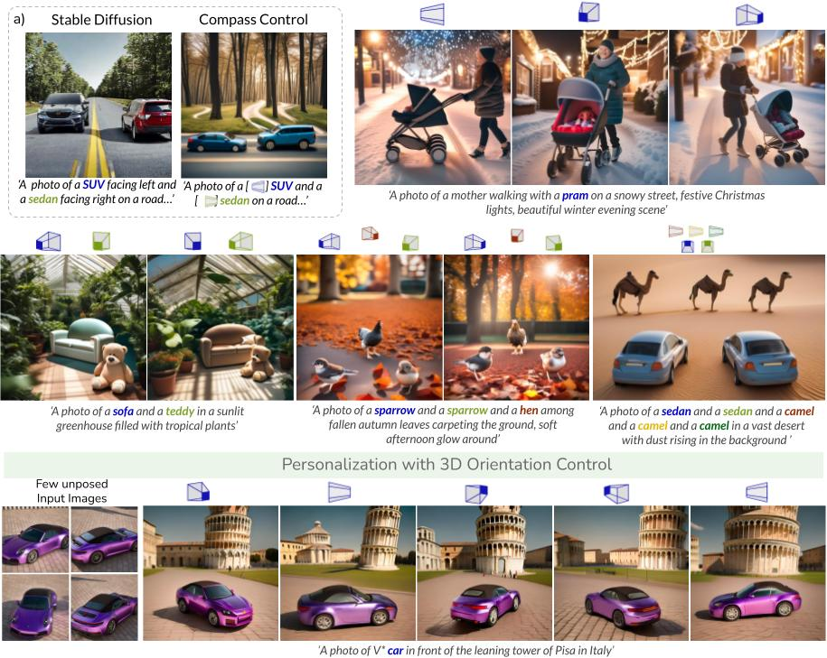

# [CVPR-25] Compass Control: Multi-Object Orientation Control for Text-to-Image Generation 

## Abstract
Compass Control enables precise and continuous object orientation control in text-to-image diffusion models. Given an input orientation angle along with a text prompt, our method can generate realistic scenes following the text prompts with object-centric orientation control.

 

## Environment setup 
The conda environment file is provided in `environment.yaml`. A list of explicit packages installed using `pip` is provided in `explicit.txt`. To setup the conda environment using the `environment.yaml` file, run
```bash
conda env create -f environment.yaml
```

## Training 
### Dataset
You can download the dataset from this [Google Drive link](https://drive.google.com/file/d/18BsBZUXvj9kyyWcudLMS-5RgkDjbqidd/view?usp=sharing) (around 1.5 GB). Place the `zip` file in the parent directory and run 
```bash
unzip compass_dataset.zip

# activate the environment (need to set it up first) 
conda activate compass 

# run training! 
cd training_scripts/ 
chmod +x run.sh 
./run.sh 
```   

## Inference

To visualize inference results, run `training_scripts/infer_vis.ipynb` in an interactive environment.  